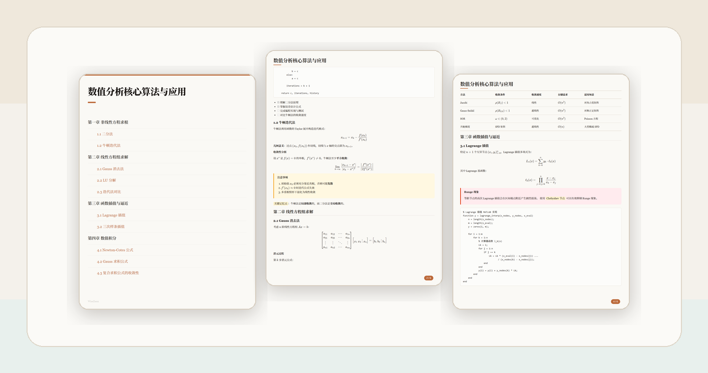

# CardDown

<p align="center">
  
</p>
<p align="center">
  <strong>Configurable Markdown-to-card rendering for shareable technical content.</strong>
</p>

<p align="center">
  <a href="./README.zh-CN.md">简体中文</a> | <a href="#quick-start">Quick Start</a> | <a href="#demo-card-set">Demo Card Set</a> | <a href="#cli-reference">CLI Reference</a>
</p>

<p align="center">
  <a href="https://www.npmjs.com/package/@carddown/cli"></a>
  <a href="./LICENSE"></a>
  <a href="https://github.com/WiseZenn/carddown/actions/workflows/ci.yml"></a>
  <a href="https://nodejs.org"></a>
</p>



CardDown turns Markdown into polished, paginated image cards for technical writing, study notes, tutorials, release notes, and social-friendly long-form content. It combines browser-accurate rendering with smart pagination, configurable card dimensions, PNG export, and a theme system that supports built-in styles plus external CSS or Typora `.zip` theme packs. The default output uses the Claude light theme at 1080x1440, but theme, width, height, padding, and scale can be tuned for different platforms and workflows.

## Why CardDown

- Smart pagination for real documents: headings, paragraphs, code blocks, tables, images, and math are arranged into readable card pages.
- Themeable presentation: the default is `claude-like`; use built-in `github` / `claude-like` themes, or bring your own CSS / Typora `.zip` theme pack.
- Configurable output: default 1080x1440 PNG cards, with custom width, height, padding, scale, cover pages, and page numbers.
- Rich Markdown support: GFM tables, task lists, syntax-highlighted code, KaTeX math, highlights, blockquotes, and Obsidian-style callouts.
- Automation friendly and safer by default: structured JSON output, raw HTML off by default, and explicit `file:` URLs gated behind trusted-input flags.

## Quick Start

```bash
npm install -g @carddown/cli
npx playwright install chromium

carddown -i document.md
```

Output images are saved to `./output/` by default. If your Markdown path contains spaces, wrap it in quotes, for example `carddown -i "my tutorial.md"`.

To update an existing global install:

```bash
npm update -g @carddown/cli
npx playwright install chromium
```

## Run From GitHub

```bash
git clone https://github.com/WiseZenn/carddown.git
cd carddown
npm ci
npx playwright install chromium

npm run dev
npm start -- --input path/to/document.md
npm start -- --help
```

`npm start --` builds the Core and CLI workspaces, then forwards the remaining arguments to the compiled `carddown` command.

## Demo Card Set

The showcase image above was generated from the included numerical-analysis demo with the Claude light theme:

```bash
npm start -- --input examples/demo-numerical-analysis.md \
  --theme claude-like \
  --output output/douyin-demo-claude-light \
  --name douyin-demo-claude-light \
  --scale 1
```

With the default card dimensions, that command produces one cover card and six content cards, convenient for a carousel post or short-video material:

```text
output/douyin-demo-claude-light/
├── douyin-demo-claude-light_00_cover.png
├── douyin-demo-claude-light_01.png
├── douyin-demo-claude-light_02.png
├── douyin-demo-claude-light_03.png
├── douyin-demo-claude-light_04.png
├── douyin-demo-claude-light_05.png
└── douyin-demo-claude-light_06.png
```

## CLI Reference

```bash
carddown -i <file> [options]
cat doc.md | carddown --json
```

| Option | Description | Default |
|--------|-------------|---------|
| `-i, --input <file>` | Input Markdown file; reads stdin if omitted | - |
| `-o, --output <dir>` | Output directory | `./output` |
| `-n, --name <name>` | Output filename prefix | Input filename or `output` |
| `--theme <name\|.css>` | Built-in theme name, or path to external `.css` / `.zip` theme | `claude-like` |
| `--scale <number>` | Output scale factor | `2` |
| `--width <px>` | Card width | `1080` |
| `--height <px>` | Card height | `1440` |
| `--padding <px>` | Card padding | `48` |
| `--no-cover` | Disable automatic cover page | - |
| `--max-code-lines <n>` | Max code lines per page (`0` = unlimited) | `0` |
| `--fill-threshold <n>` | Page fill threshold, range 0-1 | `0.85` |
| `--format <type>` | Output format: `png` or `pdf` | `png` |
| `--profile <file>` | YAML/JSON config file path | - |
| `--allow-html` | Allow raw HTML in Markdown (trusted input only) | - |
| `--allow-local-files` | Allow explicit `file:` URLs in Markdown/CSS (trusted input only) | - |
| `--json` | Output structured JSON | - |

Config precedence: explicit CLI args > `--profile` file > CLI defaults.

Numeric options are strictly validated: `--scale` must be >= 1; `--width`, `--height`, `--padding`, and `--max-code-lines` must be positive integers; `--fill-threshold` must be 0-1; `--format` must be `png` or `pdf`.

## Common Examples

```bash
carddown -i examples/sample.md
carddown -i "my tutorial.md"
carddown -i doc.md --theme github
carddown -i doc.md --theme ./custom.css --scale 1
carddown list themes
carddown list themes --json
```

## Built-in Themes

```text
github
claude-like
claude-like-dark
claude-like-grey
```

External `.css` files and Typora `.zip` theme packs are also supported. Unknown theme names or missing files produce an error. Use `carddown list themes` to see available built-in themes.

## JSON Output

```bash
carddown -i file.md --json
```

On success:

```json
{
  "status": "success",
  "images": {
    "cover": "/absolute/path/output/file_00_cover.png",
    "content": ["/absolute/path/output/file_01.png"]
  },
  "metadata": {
    "input_file": "/absolute/path/file.md",
    "output_path": "/absolute/path/output",
    "theme_used": "claude-like",
    "scale": 2,
    "page_count": 1,
    "duration_seconds": 3.2,
    "fonts_missing": []
  }
}
```

On error:

```json
{
  "status": "error",
  "images": {
    "cover": null,
    "content": []
  },
  "metadata": {
    "input_file": "missing.md",
    "output_path": "",
    "theme_used": "claude-like",
    "scale": 2,
    "page_count": 0,
    "duration_seconds": 0,
    "fonts_missing": []
  },
  "message": "ENOENT: no such file or directory"
}
```

## Security

Raw HTML in Markdown is not rendered by default. Enable it only for trusted documents:

```bash
carddown -i doc.md --allow-html
```

Explicit `file:` URLs in Markdown and external theme CSS are also rejected by default. Relative-path images are still converted to data URLs. Enable local file URLs only for trusted documents and themes:

```bash
carddown -i doc.md --allow-local-files
```

## Browser Dependency

CardDown uses Playwright to launch Chromium for rendering. If Chromium is missing:

```bash
npx playwright install chromium
```

In CI or server environments, make sure headless browser execution is allowed and install the platform-specific dependencies required by Playwright.

## Project Structure

```text
packages/
├── core/                 Reusable @carddown/core rendering API
│   └── src/
│       ├── index.ts      Public Core exports
│       ├── parser.ts     Markdown -> HTML
│       ├── paginator.ts  Playwright rendering orchestration
│       └── themes.ts     Built-in and external themes
└── cli/                  Published carddown command
    └── src/
        ├── index.ts      Commander.js entry
        └── config/       YAML/JSON config and validation
apps/
├── desktop/              Reserved for CardDown Desktop
└── studio/               Reserved for CardDown Studio
tools/                    Repository-only utilities
```

## Development

```bash
npm ci
npx playwright install chromium
npm run typecheck
npm run build
npm test
npm run test:render
npm run batch-export
```

The repository is public on GitHub. The root workspace is private only to prevent accidental publication of the workspace wrapper. `@carddown/core` is a published runtime dependency used by the `carddown` CLI.

## Contributing & Security

- Contributing guide: [CONTRIBUTING.md](./CONTRIBUTING.md)
- Security policy: [SECURITY.md](./SECURITY.md)
- Changelog: [CHANGELOG.md](./CHANGELOG.md)

## License

[MIT](./LICENSE)
